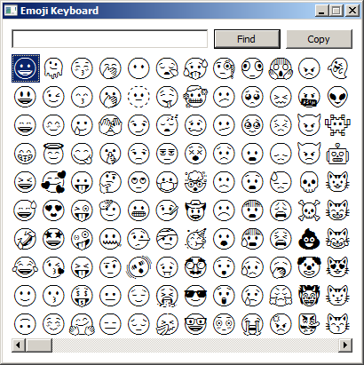


# Emoji Keyboard

Emoji picker for legacy Windows systems that are capable of displaying (some) emoji, but do not have means to pick them natively (`Win`+`.`).

Why is it called a keyboard? Originally it was meant to be capable of inserting emoji directly into other applications (like on-screen keyboard), but this functionality has been abandoned during developement.

Emoji are rendered monochrome, color support is not considered at the moment (because D2D/DirectWrite is a pain). It also currently has no application icon.

## System Requirements

- Windows XP (32-bit, ix86), Windows XP Professional x64 Edition (64-bit, amd64) or newer
  - Windows 95/98/ME with IE5+ and Windows 2000 are considered in future releases
- Font: *Segoe UI Symbol*, *Segoe UI Emoji* or *Noto Emoji*

## Installation

The release package should work out of the box, but few things may need adjustments.

### Emoji Font

Up-to-date Windows 7 and later contain *Segoe UI Symbol* font that provides (some) native Emoji support.

For Windows 7 and *older* it's also possible and recommended to use the [*Noto Emoji* font](https://fonts.google.com/noto/specimen/Noto+Emoji), either installed in the system, or as `NotoEmoji-Regular.ttf` file next to the emoji keyboard executable.

### Emoji Data

Information about available emoji is stored in an sqlite3 database, which can be rebuilt with the included Python script (developed with Python 3.10) to either update the data to [latest Unicode specification](https://www.unicode.org/emoji/charts/full-emoji-list.html), or to change the locale of keywords and labels.

The script downloads the necessary files and caches them locally. If you want the latest version, delete the cached files `emoji-test.txt`, `emoji-lann-*.txt`, `emoji-land-*.txt`.

To rebuild the data with the default English locale, run:

    python genemoji.py

To rebuild the data with a different locale (for example Japanese), run:

    python genemoji.py --locale ja

## Usage

After starting, you can either find an emoji by one keyword or scroll through the list of all emoji. You can also search emoji to find out what *that box character* actually is.

Mousing over the emoji list will display the label/description of the emoji (though this is slighly bugged).

Double clicking an emoji or selecting it and pressing `Copy` button will copy that emoji into clipboard.

## Uninstallation

Delete all files in the emoji keyboard folder. The application does not write any settings.
